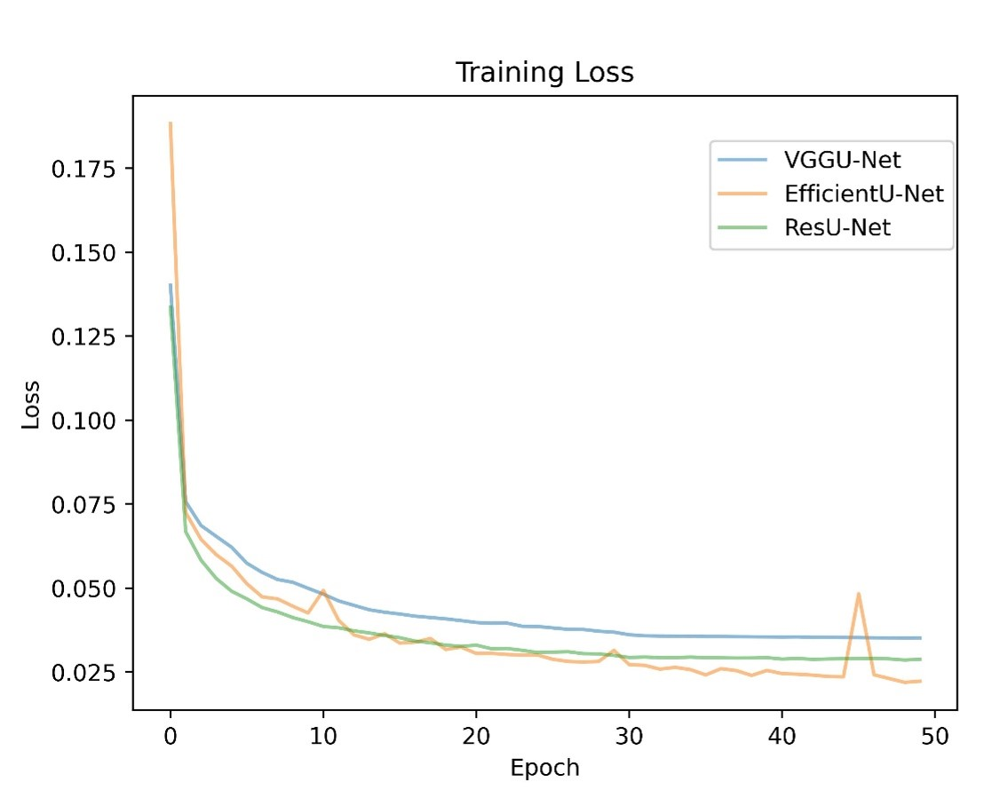
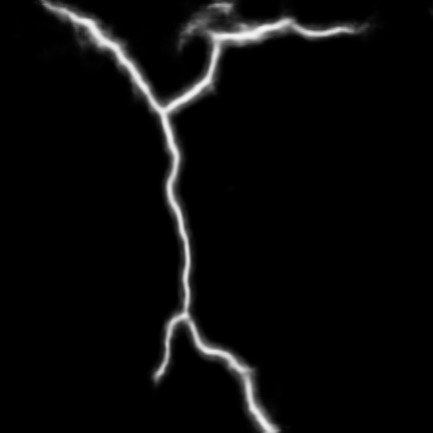
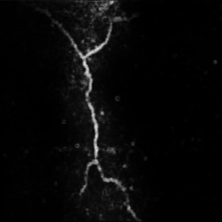
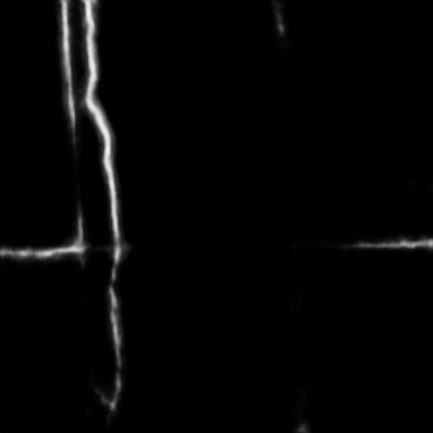

# Deep Learning-Based Crack Detection Using Advanced U-Net Architecture

裂縫本身極細小且非線性的外觀，通常在一張影像中占比極低，若要透過模型來抓取裂縫，單純以CNN較難抓取出來精細微小的特徵(如紋理、細微深度較淺的裂痕)，模型需要具備能抓取高精度特徵的能力，且裂縫的形狀會不規則橫跨整張圖片，每處裂縫局部都有細小的裂紋，因此具備高精度影像分割功能的模型對裂縫辨識非常重要，因此我們選用Unet 模型的框架為基礎，在高精度影像分割的優點下，結合不同的backbone (ResNet、Vgg116、EfficientNet)

## Dataset

**CRACK500 & CRACK Dataset for UAV Inspections**

- Train set: 6730
- Validation set: 961
- Test set: 1922

## Training Result

**Training Loss**

**Average MPA**

**Average MIoU**

## Result

**Average Test Performance Comparison**

<table class="tg">
<thead>
  <tr>
    <th class="tg-8jgo">Dataset </th>
    <th class="tg-8jgo"># of images</th>
    <th class="tg-8jgo">Model</th>
    <th class="tg-8jgo">BCELoss</th>
    <th class="tg-8jgo">MPA(%)</th>
    <th class="tg-8jgo">MIoU(%)</th>
    <th class="tg-8jgo">Test Runtime(ms)</th>
  </tr>
</thead>
<tbody>
  <tr>
    <td class="tg-v0mg" rowspan="3">CRACK500 &amp; CRACK Dataset for UAV Inspections</td>
    <td class="tg-v0mg" rowspan="3">9613</td>
    <td class="tg-v0mg">VggU-Net</td>
    <td class="tg-v0mg">0.036</td>
    <td class="tg-v0mg">90.14</td>
    <td class="tg-v0mg">78.32</td>
    <td class="tg-v0mg">50</td>
  </tr>
  <tr>
    <td class="tg-v0mg">ResU-Net</td>
    <td class="tg-v0mg">0.045</td>
    <td class="tg-v0mg">88.19</td>
    <td class="tg-v0mg">69.01</td>
    <td class="tg-v0mg">40.63</td>
  </tr>
  <tr>
    <td class="tg-v0mg">EfficientU-Net</td>
    <td class="tg-v0mg">0.089</td>
    <td class="tg-v0mg">59.09</td>
    <td class="tg-v0mg">55.7</td>
    <td class="tg-v0mg">68.76</td>
  </tr>
</tbody>
</table>

**Trying Different Thresholding Values**

**Segmentation Results**

| Original Image | Original Mask | VggU-Net | ResU-Net | EfficientU-Net |
| :------------: | :-----------: | :------: | :------: | :------------: |
|  |  |  |  |  |
|  |  |  |  |  |
|  |  |  |  |  |
|  |  |  |  |  |
|  |  |  |  |  |
|  |  |  |  |  |

## Citations

**Crack-Detection-and-Segmentation-Dataset-for-UAV-Inspections**

>   @inproceedings{liu2019deep, title={Deep Learning Based Automatic Crack Detection and Segmentation for Unmanned Aerial Vehicle Inspections}, author={Liu, Kangcheng and Han, Xiaodong and Chen, Ben M}, booktitle={2019 IEEE International Conference on Robotics and Biomimetics (ROBIO)}, number={https://ieeexplore.ieee.org/document/896}, pages={381--387}, year={2019}, organization={IEEE}}

>   @article{liu2022industrial, title={Industrial uav-based unsupervised domain adaptive crack recognitions: From system setups to real-site infrastructural inspections}, author={Liu, Kangcheng and Chen, Ben M}, journal={IEEE Transactions on Industrial Electronics}, year={2022}, publisher={IEEE}}

**CRACK500**

>    @inproceedings{zhang2016road, title={Road crack detection using deep convolutional neural network}, author={Zhang, Lei and Yang, Fan and Zhang, Yimin Daniel and Zhu, Ying Julie}, booktitle={Image Processing (ICIP), 2016 IEEE International Conference on}, pages={3708--3712}, year={2016}, organization={IEEE} }' .

>   @article{yang2019feature, title={Feature Pyramid and Hierarchical Boosting Network for Pavement Crack Detection}, author={Yang, Fan and Zhang, Lei and Yu, Sijia and Prokhorov, Danil and Mei, Xue and Ling, Haibin}, journal={IEEE Transactions on Intelligent Transportation Systems}, year={2019}, publisher={IEEE} }

